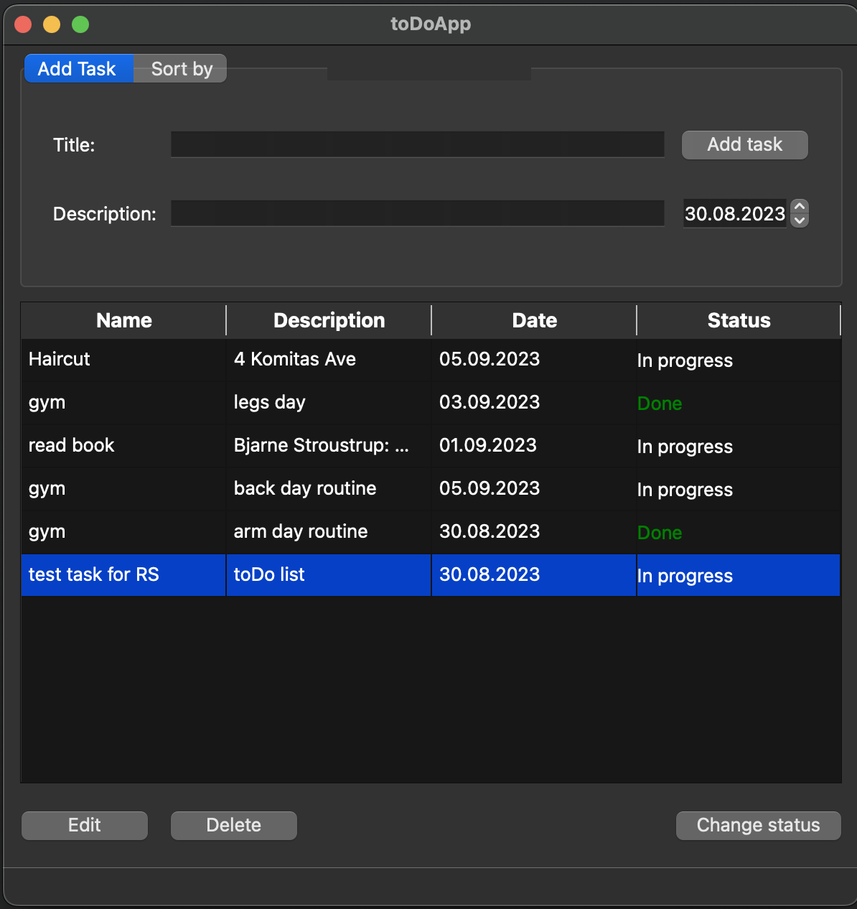
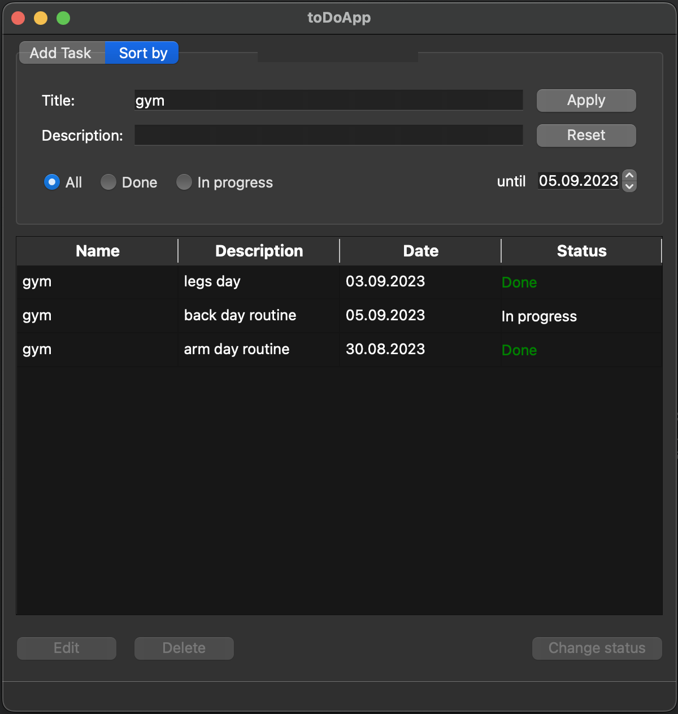

# RS test task

## TODO-list

### Задание и требования

Приложение Mенеджер задач (TODO-list).

Графический интерфейс  

(рис. 1) add task

(рис. 2) sort task  

1. Необходимо отображать список текущих задач
2. Должны быть интерфейсы управления задачами в списке согласно командам
3. Необходим интерфейс фильтрации задач по состоянию, диапазону дат, названию и описанию независимо. Примененный фильтр должен сбрасываться по кнопке.

Команды:

1. Добавление новой задачи
  Задача представляет собой объект со следующими атрибутами

- Название
- Описание
- Дата
- Состояние (Выполняется или Выполнено)

2. Отметить задачу выполненной (или вернуть ей исходное состояние)
3. Обновить описание задачи, которая позволяет обновить только Название, Описание и Дату задачи
4. Удалить задачу

Список задач должен храниться в постоянной памяти и подгружаться при старте приложения. Варианты хранения могут быть различными файл, БД и т.д.

Обязательно использование:

- Язык C++17
- Qt6
- CMake 3.20+

## Сборка и тесты

Для тестирования использовалась библиотека `gtest`.  
Сборку можно осуществить из папки __src__ при помощи __Makefile__ командой `make`.  
Тесты запускаются командой `make tests`. Тесты выполнены исключительно для проверки возможности наполнения контейнера __Тасками__ и удаления их.  
